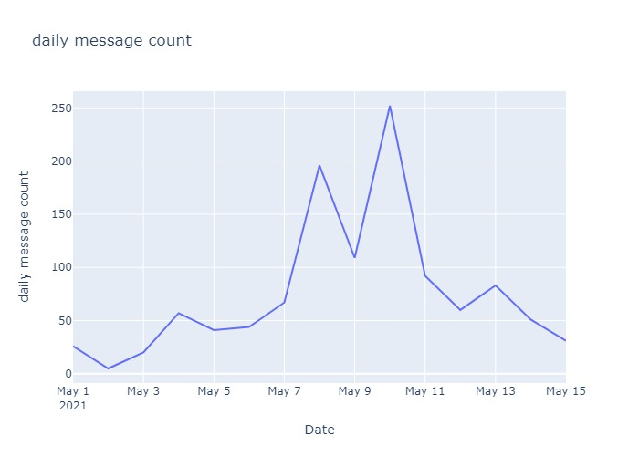
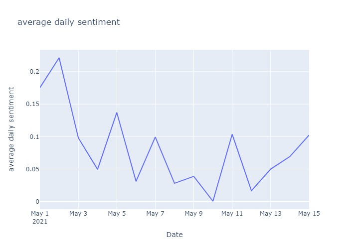

# MINDS + Center on Knowledge Graphs  Programming Assignment


### Summary of Results






***

### Documentation for Code

[main](main.py) 

- Accepts arguments from the user. 
- Reads input data from input file, processes the messages and saves the output to the user-specified output file.
- Generates plots for messages per day and average sentiment per day.

[preprocessing](preprocessing.py)

- Utility for main.
- Discards non-english messages.
- Identifies messages with specific words.

[sentiment analyzer](sentiment_analyzer.py)

- Performs sentiment analysis on processed messages using Vader Sentiment analyis model.

[plot](plot.py)

- Accepts input text file, output filename and title for the graph, plots line graph using using plotly, displays and saves the static graph using the output filename.

***

### Instructions for running the script

- Clone the repository.

```
git clone https://github.com/priya-mane/MINDS-Center-on-Knowledge-Graphs_Programming_Assignment.git
```

- Create a Virtual Environment.

```
python -m venv env
```

- Activate the Virtual Enviornment we just created.

```
.\env\Scripts\activate
```

- Install dependencies.

```
pip install -r requirements.txt
```

- Run the script.

```
python main.py -i <input file path>.json -o <output filename>
```

Eg. 
```
python main.py -i telegram_messages.json -o output
```

- Plot Graphs

Mention input filename, output filename and the title for the graph

```
python plot.py -i daily_message_count.txt -o daily_message_count -t "daily message count"
```

- For knowing more about the script.

```
python main.py --help
```
***


